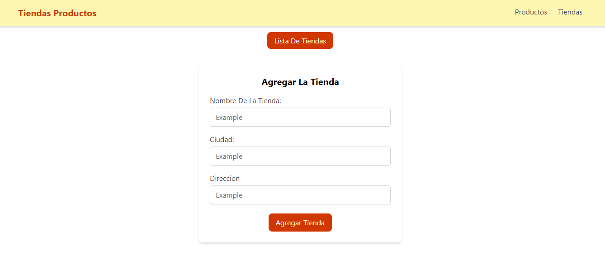
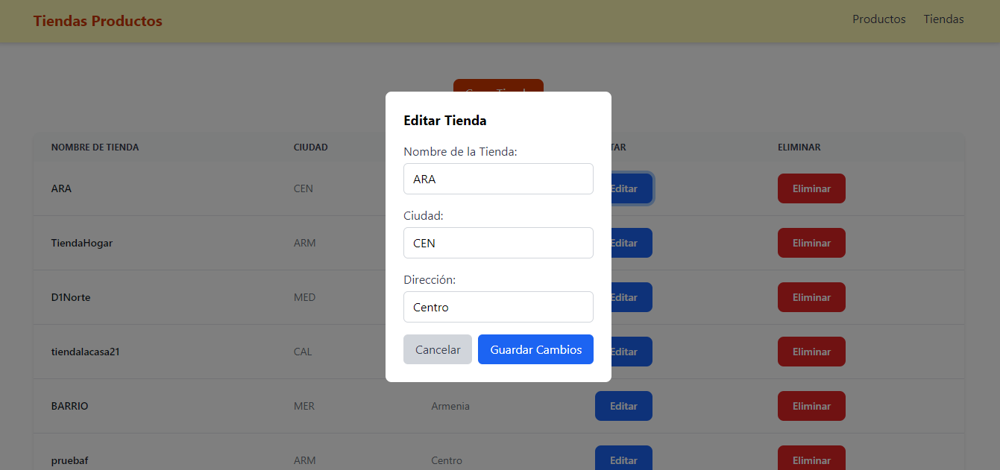
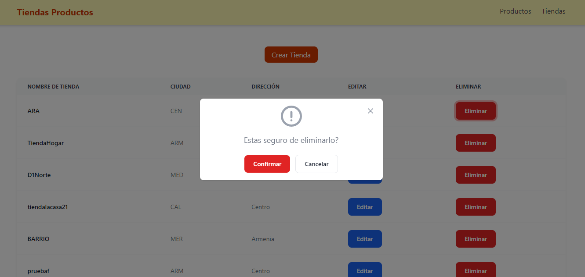
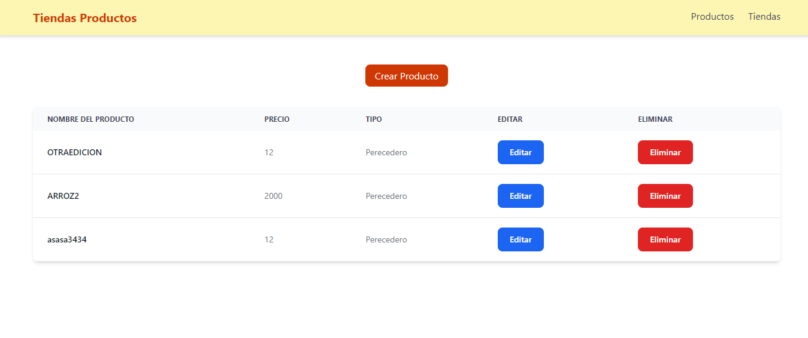
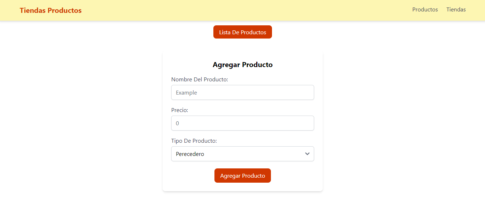
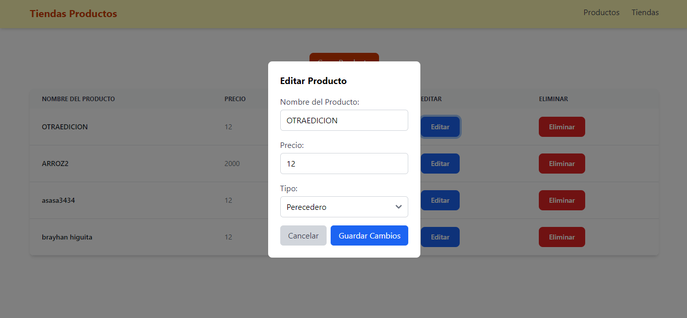
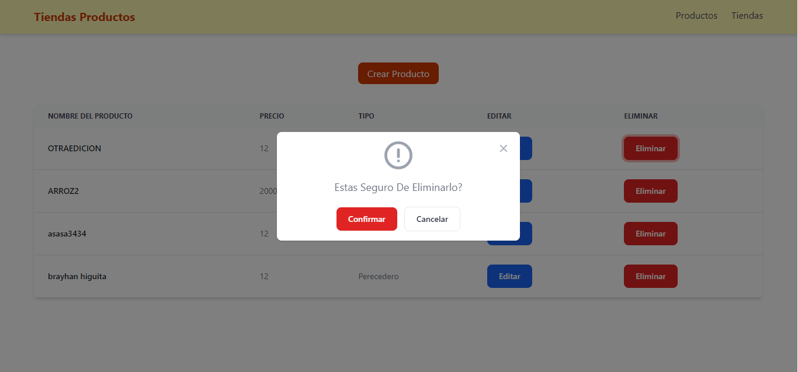

# frontend

Este es un proyecto de gestión de productos y tiendas construido con **React/vite** y **Tailwind CSS** en el frontend, y **NestJS** con **PostgreSQL** en el backend. La aplicación permite a los usuarios agregar, editar y eliminar productos en una base de datos.

## Características

- Agregar nuevos productos y tiendas a la base de datos.
- Editar productos y tiendas existentes.
- Eliminar productos y tiendas.
- Interfaz de usuario atractiva y responsiva utilizando Tailwind CSS.
- Validaciones en formularios.
- Comunicación con un backend construido en NestJS.
- Persistencia de datos en PostgreSQL.

## Tecnologías Usadas

- **Frontend**:
  - [React](https://reactjs.org/) - Biblioteca de JavaScript para construir interfaces de usuario.
  - [vite](https://vite.dev/) - Herramienta de construcción para facilitar el desarrollo de aplicaciones web.
  - [Tailwind CSS](https://tailwindcss.com/) - Framework de CSS para un diseño rápido y eficiente.

- **Backend**:
  - [NestJS](https://nestjs.com/) - Framework para construir aplicaciones de servidor eficientes y escalables.
  - [PostgreSQL](https://www.postgresql.org/) - Sistema de gestión de bases de datos relacional.

## Instalaciónes
- [react-router-dom] para manejar la navegación y el enrutamiento en aplicaciones.
- [axios] librería para hacer solicitudes HTTP desde el navegador.
- [zustand] librería para la gestión del estado en aplicaciones.
- [yup] librería de validación de esquemas.
- [react-hook-form] librería para manejar formularios.

### Requisitos Previos

- Node.js (versión 14 o superior).
- PostgreSQL (versión 12 o superior).

### Configuracion
### Frontend
    1. Clona el repositorio del Frontend.
    2.  Instalacion de depencencias.
    3.  Configura el endpoint del backend.
    4.  Iniciar el servidor.

### Backend
    1. Clona el repositorio del backend.
    2.  Instalacion de depencencias.
    3.  Configuracion de la bd.
    4.  Iniciar el servidor.

### Anexos Capturas De Pantalla
#Pantalla Principal

#Formulario Agregar tienda

#Modal de Edición de Tienda

#Modal de Eliminación Tienda

#Lista De Productos

#Formulario Agregar Producto

#Modal de Edición de Producto

#Modal de Eliminación Producto

### Implementacion De Estilos
##Descripción de Estilos Utilizados en el Formulario

-Estructura de Tabla:Se utiliza un diseño de tabla con clases de Tailwind para definir el espaciado (px-6 py-3 para encabezados y px-6 py-4 para celdas), asegurando un diseño limpio y ordenado.

-Colores y Temas:Las filas de la tabla alternan entre un fondo blanco (bg-white) y un gris oscuro para el modo oscuro (dark:bg-gray-800). Esto mejora la legibilidad y la estética.

-Tipografía:Se aplican clases como font-medium y text-gray-900 para el texto, proporcionando un contraste adecuado y una jerarquía visual clara.

-Botones:Los botones de "Editar" y "Eliminar" utilizan clases como bg-blue-600 y bg-red-600, respectivamente, con efectos de hover (hover:bg-blue-700, hover:bg-red-700) para resaltar la interactividad. Además, se les añade un enfoque visual (focus:ring-4), mejorando la accesibilidad.

-Diseño Responsivo:El uso de clases de espaciado y diseño flexible permite que la tabla se adapte bien a diferentes tamaños de pantalla, manteniendo la usabilidad en dispositivos móviles y de escritorio.
Estos estilos contribuyen a una interfaz intuitiva y atractiva, mejorando la experiencia del usuario al interactuar con el formulario.

##Descripción de Estilos Utilizados en el Modal

-Fondo y Opacidad:El modal se presenta sobre un fondo negro semitransparente (bg-black bg-opacity-50), lo que ayuda a centrar la atención del usuario en el contenido del modal al desdibujar el resto de la página.

-Diseño de Contenedor:El contenedor principal del modal utiliza clases como relative, bg-white, y rounded-lg para crear un efecto de tarjeta con bordes redondeados y una sombra sutil (shadow), lo que proporciona una sensación de profundidad.

-Botón de Cierre:Un botón de cierre se sitúa en la esquina superior derecha con un diseño minimalista, que incluye un icono SVG y cambios de color al pasar el mouse (hover:bg-gray-200). Esto mejora la usabilidad y la accesibilidad.

-Tipografía y Espaciado:El texto se centra y se utiliza una tipografía clara con un tamaño adecuado (text-lg y text-gray-500), garantizando que el mensaje sea fácil de leer.

-Botones de Acción:Los botones "Confirmar" y "Cancelar" están estilizados con colores distintivos: el primero en rojo (bg-red-600) para resaltar la acción de eliminación, y el segundo en blanco con un borde gris para opciones menos urgentes. Ambos botones incluyen efectos de hover y enfoque (focus:ring), mejorando la experiencia del usuario.
